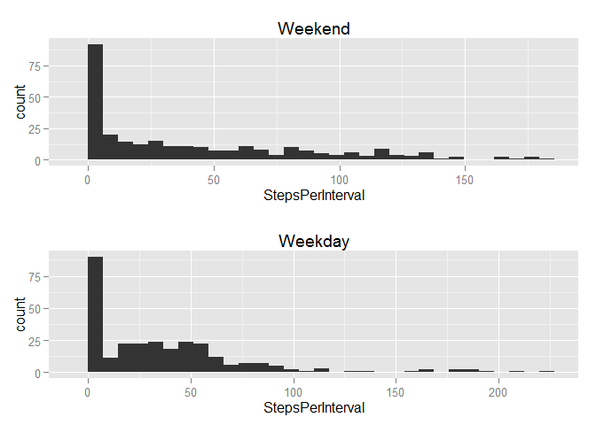

# Reproducible Research: Peer Assessment 1
## Loading and preprocessing the data

```r
setwd("C:/Users/Dan/Dropbox/personal/Coursera/data science certificate/Reproducible research/course projects/RepData_PeerAssessment1")
## the directory where the assignment repository was cloned. 
## I was not able to read a csv file directly out of a zipped folder, so I make a new directory 
## instead 

## unzip("activity.zip", exdir="activity") ## no need to run again in knitr

activity <- read.csv("activity.csv", header=T)

## take a look at and process data

activityNames <- data.frame(names(activity))
description <- c("Number of steps taken in a 5-minute interval","Date of measurement","5-minute interval in which measurement was taken")
activityNames <- data.frame(cbind(activityNames,description))
activityNames
```

```
##   names.activity.                                      description
## 1           steps     Number of steps taken in a 5-minute interval
## 2            date                              Date of measurement
## 3        interval 5-minute interval in which measurement was taken
```

```r
require(psych)
```

```
## Loading required package: psych
```

```r
describe(activity)
```

```
## Warning in FUN(newX[, i], ...): no non-missing arguments to min; returning
## Inf
```

```
## Warning in FUN(newX[, i], ...): no non-missing arguments to max; returning
## -Inf
```

```
##          vars     n    mean     sd median trimmed    mad min  max range
## steps       1 15264   37.38 112.00    0.0     8.0   0.00   0  806   806
## date*       2 17568     NaN     NA     NA     NaN     NA Inf -Inf  -Inf
## interval    3 17568 1177.50 692.45 1177.5  1177.5 889.56   0 2355  2355
##          skew kurtosis   se
## steps    4.17    18.43 0.91
## date*      NA       NA   NA
## interval 0.00    -1.20 5.22
```

```r
require(dplyr)
```

```
## Loading required package: dplyr
## 
## Attaching package: 'dplyr'
## 
## The following object is masked from 'package:stats':
## 
##     filter
## 
## The following objects are masked from 'package:base':
## 
##     intersect, setdiff, setequal, union
```

```r
tbl_df(activity)
```

```
## Source: local data frame [17,568 x 3]
## 
##    steps      date interval
## 1     NA 10/1/2012        0
## 2     NA 10/1/2012        5
## 3     NA 10/1/2012       10
## 4     NA 10/1/2012       15
## 5     NA 10/1/2012       20
## 6     NA 10/1/2012       25
## 7     NA 10/1/2012       30
## 8     NA 10/1/2012       35
## 9     NA 10/1/2012       40
## 10    NA 10/1/2012       45
## ..   ...       ...      ...
```
## What is mean total number of steps taken per day?
For this part of the assignment, you can ignore the missing values in the dataset.

    Make a histogram of the total number of steps taken each day


```r
byDay <- group_by(activity, date)
byDaySum <- summarise(byDay, TotalSteps=sum(steps,na.rm=T))

require(ggplot2)
```

```
## Loading required package: ggplot2
## 
## Attaching package: 'ggplot2'
## 
## The following object is masked from 'package:psych':
## 
##     %+%
```

```r
ggplot(byDaySum, aes(TotalSteps)) + geom_histogram()
```

```
## stat_bin: binwidth defaulted to range/30. Use 'binwidth = x' to adjust this.
```

 

```r
dev.copy(png, "instructions_fig/Total steps per interval.png")
```

```
## png 
##   3
```

```r
dev.off()
```

```
## png 
##   2
```

    Calculate and report the mean and median total number of steps taken per day


```r
describe(byDaySum)
```

```
## Warning in FUN(newX[, i], ...): no non-missing arguments to min; returning
## Inf
```

```
## Warning in FUN(newX[, i], ...): no non-missing arguments to max; returning
## -Inf
```

```
##            vars  n    mean     sd median trimmed     mad min   max range
## date*         1 61     NaN     NA     NA     NaN      NA Inf  -Inf  -Inf
## TotalSteps    2 61 9354.23 5405.9  10395 9503.29 4532.31   0 21194 21194
##             skew kurtosis     se
## date*         NA       NA     NA
## TotalSteps -0.38    -0.52 692.15
```
The mean is 9,354 and the median is 10,395

## What is the average daily activity pattern?
    Make a time series plot (i.e. type = "l") of the 5-minute interval (x-axis) and the average number of steps taken, averaged across all days (y-axis)
    

```r
byInterval <- group_by(activity,interval)
byIntervalMean <- summarise(byInterval, StepsPerInterval=mean(steps,na.rm=T))
ggplot(byIntervalMean, aes(interval, StepsPerInterval)) + geom_line()
```

 

```r
dev.copy(png, "instructions_fig/Average steps per interval.png")
```

```
## png 
##   3
```

```r
dev.off()
```

```
## png 
##   2
```

    Which 5-minute interval, on average across all the days in the dataset, contains the maximum number of steps?


```r
summary(byIntervalMean)
```

```
##     interval      StepsPerInterval 
##  Min.   :   0.0   Min.   :  0.000  
##  1st Qu.: 588.8   1st Qu.:  2.486  
##  Median :1177.5   Median : 34.113  
##  Mean   :1177.5   Mean   : 37.383  
##  3rd Qu.:1766.2   3rd Qu.: 52.835  
##  Max.   :2355.0   Max.   :206.170
```

```r
describe(byIntervalMean)
```

```
##                  vars   n    mean     sd  median trimmed    mad min
## interval            1 288 1177.50 693.64 1177.50 1177.50 889.56   0
## StepsPerInterval    2 288   37.38  38.66   34.11   31.34  38.86   0
##                      max   range skew kurtosis    se
## interval         2355.00 2355.00 0.00    -1.22 40.87
## StepsPerInterval  206.17  206.17 1.66     3.74  2.28
```

```r
arrange(byIntervalMean, desc(StepsPerInterval))
```

```
## Source: local data frame [288 x 2]
## 
##    interval StepsPerInterval
## 1       835         206.1698
## 2       840         195.9245
## 3       850         183.3962
## 4       845         179.5660
## 5       830         177.3019
## 6       820         171.1509
## 7       855         167.0189
## 8       815         157.5283
## 9       825         155.3962
## 10      900         143.4528
## ..      ...              ...
```
Interval #835
## Imputing missing values
Note that there are a number of days/intervals where there are missing values (coded as NA). The presence of missing days may introduce bias into some calculations or summaries of the data.

    Calculate and report the total number of missing values in the dataset (i.e. the total number of rows with NAs)


```r
count(activity[activity=="NA",])
```

```
## Source: local data frame [1 x 1]
## 
##      n
## 1 2304
```
2,304

Devise a strategy for filling in all of the missing values in the dataset. The strategy does not need to be sophisticated. For example, you could use the mean/median for that day, or the mean for that 5-minute interval, etc.


```r
activityImputed <- activity
activityImputed <- left_join(activityImputed, byIntervalMean)
```

```
## Joining by: "interval"
```

```r
for(i in 1:length(activityImputed$steps)) {
    if(is.na(activityImputed$steps[i]==T)) { (activityImputed$steps[i]=activityImputed$StepsPerInterval[i]) } }
```


Create a new dataset that is equal to the original dataset but with the missing data filled in.

This is the activityImputed data set established above. 

    Make a histogram of the total number of steps taken each day and Calculate and report the mean and median total number of steps taken per day. Do these values differ from the estimates from the first part of the assignment? What is the impact of imputing missing data on the estimates of the total daily number of steps?


```r
byDayImputed <- group_by(activityImputed,date)
byDayImputedSum <- summarise(byDayImputed, TotalSteps=sum(steps))
ggplot(byDayImputedSum,aes(TotalSteps)) + geom_histogram()
```

```
## stat_bin: binwidth defaulted to range/30. Use 'binwidth = x' to adjust this.
```

 

```r
dev.copy(png, "instructions_fig/Total steps per interval - imputed.png")
```

```
## png 
##   3
```

```r
dev.off()
```

```
## png 
##   2
```

```r
summary(byDayImputedSum)
```

```
##          date      TotalSteps   
##  10/1/2012 : 1   Min.   :   41  
##  10/10/2012: 1   1st Qu.: 9819  
##  10/11/2012: 1   Median :10766  
##  10/12/2012: 1   Mean   :10766  
##  10/13/2012: 1   3rd Qu.:12811  
##  10/14/2012: 1   Max.   :21194  
##  (Other)   :55
```
The mean and median are both 10,766. This is higher than the original dataset because there are more observations at the center (mean) of each interval's distribution.   
## Are there differences in activity patterns between weekdays and weekends?
For this part the weekdays() function may be of some help here. Use the dataset with the filled-in missing values for this part.

    Create a new factor variable in the dataset with two levels - "weekday" and "weekend" indicating whether a given date is a weekday or weekend day.


```r
activityImputed$date <- as.POSIXlt(activityImputed$date,format="%m/%d/%Y")
str(activityImputed$date)
```

```
##  POSIXlt[1:17568], format: "2012-10-01" "2012-10-01" "2012-10-01" "2012-10-01" ...
```

```r
activityImputed$day <- weekdays(activityImputed$date)
for(i in 1:length(activityImputed$day)) {
if(activityImputed$day[i]=="Saturday") { activityImputed$weekend[i]="Yes" }
if(activityImputed$day[i]=="Sunday") {activityImputed$weekend[i]="Yes" }
else activityImputed$weekend[i]="No" }
```
    Make a panel plot containing a time series plot (i.e. type = "l") of the 5-minute interval (x-axis) and the average number of steps taken, averaged across all weekday days or weekend days (y-axis). The plot should look something like the following, which was creating using simulated data:


```r
noDate <- select(activityImputed, -date)
byIntervalImputed <- group_by(noDate, interval)
weekend <- byIntervalImputed[byIntervalImputed$weekend=="Yes",]
weekday <- byIntervalImputed[byIntervalImputed$weekend=="No",]
weekendSteps <- summarise(weekend, StepsPerInterval=mean(steps))
weekdaySteps <- summarise(weekday, StepsPerInterval=mean(steps))
weekendPlot <- ggplot(weekendSteps, aes(StepsPerInterval)) + geom_histogram() + ggtitle("Weekend")
weekdayPlot <- ggplot(weekdaySteps, aes(StepsPerInterval)) + geom_histogram() + ggtitle("Weekday")
require(gridExtra)
```

```
## Loading required package: gridExtra
## Loading required package: grid
```

```r
grid.arrange(weekendPlot, weekdayPlot)
```

```
## stat_bin: binwidth defaulted to range/30. Use 'binwidth = x' to adjust this.
## stat_bin: binwidth defaulted to range/30. Use 'binwidth = x' to adjust this.
```

 

```r
dev.copy(png, "instructions_fig/Mean steps per interval by weekday or weekend.png")
```

```
## png 
##   3
```

```r
dev.off()
```

```
## png 
##   2
```

Definitely a difference. During the week you have movement that peaks in the morning then settles. During the weekend you have steady movement throughout the day. 
